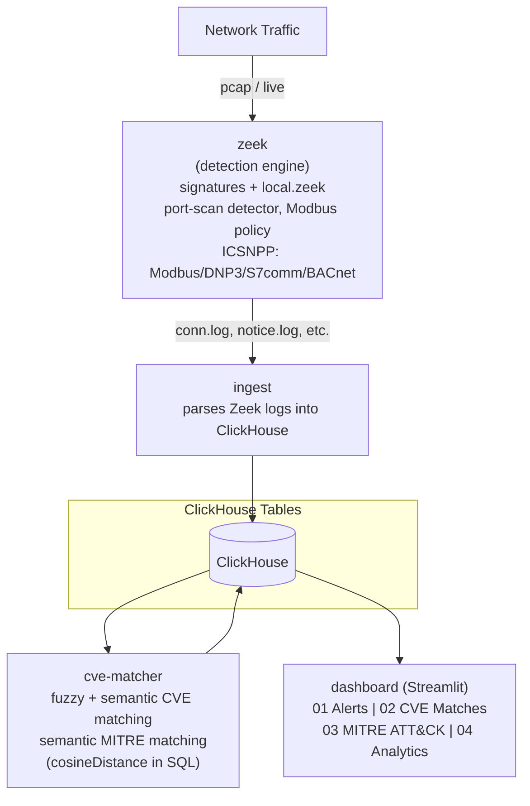

# Network IDS - Zeek + ClickHouse + Semantic SIEM Dashboard

    

A lightweight SIEM (Security Information and Event Management) pipeline.
Zeek watches network traffic and raises behavioral + signature-based
alerts; those alerts are semantically correlated against real NVD CVE
data and the MITRE ATT&CK Enterprise matrix, with everything - raw logs,
reference data, embeddings, and correlation results - stored in
ClickHouse. A Streamlit dashboard presents the result as a console-style
SIEM console.

**Current stack: Zeek -> ClickHouse -> Python (fuzzy + semantic matching,
using ClickHouse's native `cosineDistance()`) -> Streamlit.**
ClickHouse holds full-fidelity raw logs (not just aggregates) alongside
the vector embeddings used for semantic correlation - one database for
both structured analytics and semantic search.

---

## 1. Architecture diagram



All services run as separate containers via `docker-compose.yml`,
communicating over the compose network. **ClickHouse is the single
source of truth.** Tables: `alerts`, `software`, `cve_descriptions`,
`mitre_attack`, `cve_matches`, `mitre_matches`, `connection_stats`.

---

## 2. Why ClickHouse (and why *semantic* correlation still works)

A traditional SIEM matches alerts to threat intel using exact keyword or
regex rules. Here, CVE descriptions, MITRE ATT&CK technique descriptions,
and software strings are embedded (via `sentence-transformers`,
`all-MiniLM-L6-v2`) into the same vector space, stored as
`Array(Float32)` columns, and compared with ClickHouse's native
`cosineDistance()` function directly in SQL. That means an alert like
*"192.168.2.53: Plaintext FTP credentials observed"* can still be
matched to the MITRE technique **T1071.002 - File Transfer Protocols**
even though the alert text and the technique description share almost
no exact words - the match is on *meaning*, not string overlap, exactly
as before. The difference from the earlier design is that this now
happens inside a structured database that also gives full-fidelity
relational storage for raw logs, joins, and IT/OT analytics - rather
than needing a separate vector-only store.

---

## 3. Service-by-service breakdown

### `zeek`
Runs Zeek against captured/replayed traffic. Two custom detection
mechanisms sit alongside Zeek's built-in signature framework:
- **Port-scan detector** (`ScanDetect::Possible_Port_Scan`) -- behavioral,
  flags a host touching many distinct destination ports in a short window.
- **Modbus write policy** -- flags unauthorized/unexpected Modbus
  (industrial control protocol) write operations, relevant for OT/ICS
  security scenarios.
- Signature framework (`signatures/`) catches known-bad patterns
  (e.g. plaintext FTP credentials, suspicious Modbus diagnostic function
  codes).
- **ICSNPP packages** (CISA/INL, installed via `zkg`) provide extended
  Modbus, DNP3, S7comm, and BACnet analyzers with their own dedicated
  logs, so OT protocol traffic gets properly classified instead of
  folding into a generic `conn.log` entry.

### `ingest`
Parses Zeek's output logs and writes structured rows into ClickHouse:
- **`alerts`** -- every flagged event, with a `severity` and IT/OT `zone` field.
- **`software`** -- detected software/versions per host, used for CVE matching.
- **`connection_stats`** -- a *pre-aggregated* protocol/zone breakdown of
  every connection Zeek observed (not just alerted ones). Captures can
  contain hundreds of thousands to millions of connection records, so
  this is computed in plain Python (a `Counter` over `(zone, service)`
  pairs) rather than as an individually-searchable row per connection --
  the naive per-row embedding approach was tried first in an earlier
  iteration and was projected to take 15+ hours on a full capture; the
  aggregated version processes the same data in under a second.
- Every known OT service name (from Zeek's built-ins and the ICSNPP
  packages above) is listed explicitly in `OT_SERVICES`, so nothing
  silently falls out of the IT/OT split.

### `cve-matcher` (`match_cve.py`)
Runs two independent matching passes in a loop:

1. **`match_software_to_cve`** -- for every detected software+version,
   tries (a) fuzzy string matching (`rapidfuzz`, threshold 70) against a
   keyword field on each CVE, and (b) semantic search
   (`cosineDistance()`, distance threshold 1.1) against embedded CVE
   descriptions stored in ClickHouse. Both match types are kept and
   tagged (`match_type: fuzzy` / `semantic`).

2. **`match_alerts_to_mitre`** -- semantic search only, scoped to
   high/critical severity alerts (mirrors real SOC triage -- map the
   serious incidents to attacker techniques first). Results commit to
   ClickHouse every 5 alerts rather than in one batch at the end, so a
   crash mid-run only loses a few seconds of work.

### `clickhouse`
The single data store. Tables: `alerts`, `software`, `cve_descriptions`,
`mitre_attack` (reference data with embeddings, rebuilt every 15 minutes
from cached NVD/MITRE JSON), `cve_matches`, `mitre_matches`,
`connection_stats` (results). Schema loads automatically on first
startup from `clickhouse/schema.sql`.

### `dashboard` (`app.py`, Streamlit)
Reads directly from ClickHouse via SQL and renders four tabs:
- **[01] Alerts** -- severity-filterable table + severity split chart.
- **[02] CVE Matches** -- matched software/CVE pairs with CVSS scores.
- **[03] MITRE ATT&CK** -- matched alert/technique pairs with a
  tactic-distribution chart.
- **[04] Analytics** -- deeper-dive views: IT vs OT traffic split, full
  protocol/service mix (from real `conn.log` data, not just alerted
  traffic), alert trends over time, top source hosts, CVSS distribution,
  and most common ATT&CK techniques. Kept in a separate tab so the core
  three views stay quick to scan.

---

## 4. How to run it

```bash
# Bring up the data store first - schema auto-loads on first start
docker compose up -d clickhouse

# Bring up the dashboard (reads existing ClickHouse data)
docker compose up -d dashboard
# then open http://localhost:8501
```

To regenerate correlations from scratch (e.g. after new Zeek data):

```bash
docker compose up -d zeek ingest
# wait for ingest to finish, then:
docker compose up -d cve-matcher
docker compose logs -f cve-matcher
# once "MITRE pass complete" appears and CVE matching has settled:
docker compose stop cve-matcher
```

---

## 5. Design decisions worth knowing

- **MITRE correlation is scoped to high/critical alerts only** -- a
  deliberate triage decision (mirrors real analyst workflow), not a
  technical limitation.
- **`connection_stats` is aggregated, not per-row** -- see the `ingest`
  section above. This was a real architectural correction made after
  discovering the per-connection-embedding approach didn't scale.
- **Embeddings are computed explicitly with `sentence-transformers`**
  before every semantic query, then compared via ClickHouse's
  `cosineDistance()` -- unlike a dedicated vector database, ClickHouse
  doesn't embed query text automatically, so that step is now visible
  in `match_cve.py` rather than hidden inside the data store.
- **PyArrow is pinned (`14.0.2`)** in `dashboard/requirements.txt` --
  an unpinned version caused a native segfault (`libarrow.so`, exit
  code 139) under Streamlit's dataframe rendering on certain data
  shapes.

---

## 6. Project history: the ChromaDB -> ClickHouse pivot

<details>
<summary>Click to expand -- architectural history, useful context for a viva/interview but not required reading to understand the current system.</summary>

An earlier version of this project used ChromaDB as a single
vector-only data store, with `connection_stats` aggregation computed in
Python and pushed to ChromaDB as a small summary. That design was
replaced with the current ClickHouse-based architecture after IT/OT
protocol traffic stopped displaying correctly and log fidelity was
being lost relative to Zeek's raw `conn.log`. The root cause traced
back to services that weren't explicitly mapped to an IT/OT zone
silently falling out of classification. The fix combines two things:
(1) every known OT service name (including the newly-added ICSNPP
protocol analyzers) is now listed explicitly in `ingest.py`'s
`OT_SERVICES`, and (2) ClickHouse stores full raw log rows rather than
only a pre-aggregated summary, so the dashboard's Analytics tab reflects
everything Zeek actually saw. Semantic CVE/MITRE correlation was kept
by computing embeddings explicitly with `sentence-transformers` and
comparing them with ClickHouse's native `cosineDistance()` function --
no separate vector store needed.

**If you're reading this repo's history:** an even earlier design used
ClickHouse alongside Suricata before that was itself replaced with the
ChromaDB-only design described in older commits. The current system --
described in every section above -- uses Zeek + ClickHouse only, with
semantic search implemented as vector columns and SQL functions rather
than a dedicated vector database.

</details>

---

## 7. Anticipated viva / interview questions

**Q: Why ClickHouse instead of a dedicated vector database?**
A: ClickHouse's native `cosineDistance()` function and `Array(Float32)`
columns give the same nearest-neighbor semantic search a vector
database would, while also providing full relational storage, joins,
and fast aggregate analytics (the IT/OT and protocol-mix breakdowns) in
the same place -- one technology to deploy and reason about instead of
two.

**Q: What's the difference between the fuzzy and semantic CVE matches?**
A: Fuzzy matching (`rapidfuzz.partial_ratio`) catches near-exact string
overlaps -- fast, precise, brittle to phrasing. Semantic matching embeds
both sides into the same vector space and finds nearest neighbors via
`cosineDistance()` -- catches conceptually related matches fuzzy
matching would miss.

**Q: Why do you only correlate high/critical alerts against MITRE?**
A: Deliberate triage design mirroring real analyst workflow, not a
technical limitation.

**Q: Tell me about a bug you found and fixed in this project.**
A: After an earlier migration to a vector-only store, OT protocol
traffic (Modbus, DNP3, S7comm, BACnet) stopped showing up correctly in
the dashboard's IT/OT breakdown, and some raw connection records were
missing relative to Zeek's own `conn.log`. The cause was that any
service name not explicitly mapped to a zone fell through
unclassified. I fixed it by listing every known OT service name
explicitly, added CISA's ICSNPP Zeek packages for proper OT protocol
parsing, and moved to storing full raw log rows in ClickHouse instead
of only a pre-aggregated summary, so nothing gets silently dropped.

**Q: What would productionization need beyond this?**
A: Multi-tenant support, an authentication layer on the dashboard,
horizontal scaling of the embedding/matching workers, a proper
alerting/notification layer (Slack/email/webhook on high-confidence
matches), and likely a security-domain fine-tuned embedding model to
improve match precision over the default general-purpose one.

---

## 8. File map

```
docker-compose.yml        - orchestrates all services
clickhouse/
  schema.sql               - table definitions, auto-loaded on first start
zeek/
  local.zeek               - Zeek script config, loads custom detectors + ICSNPP packages
  signatures/               - signature framework rules
  entrypoint.sh
  Dockerfile
cve/
  match_cve.py              - CVE + MITRE matching logic (ClickHouse + cosineDistance)
  fetch_cve.py               - pulls NVD CVE data
  fetch_mitre.py              - pulls MITRE ATT&CK Enterprise data
  cve_data/                    - cached reference datasets
  entrypoint.sh
  Dockerfile
dashboard/
  app.py                    - Streamlit SIEM console (4 tabs)
  requirements.txt          - streamlit, clickhouse-connect, pandas, plotly, pyarrow (pinned)
  Dockerfile
ingest/
  ingest.py                 - parses Zeek logs into ClickHouse
  Dockerfile
```
