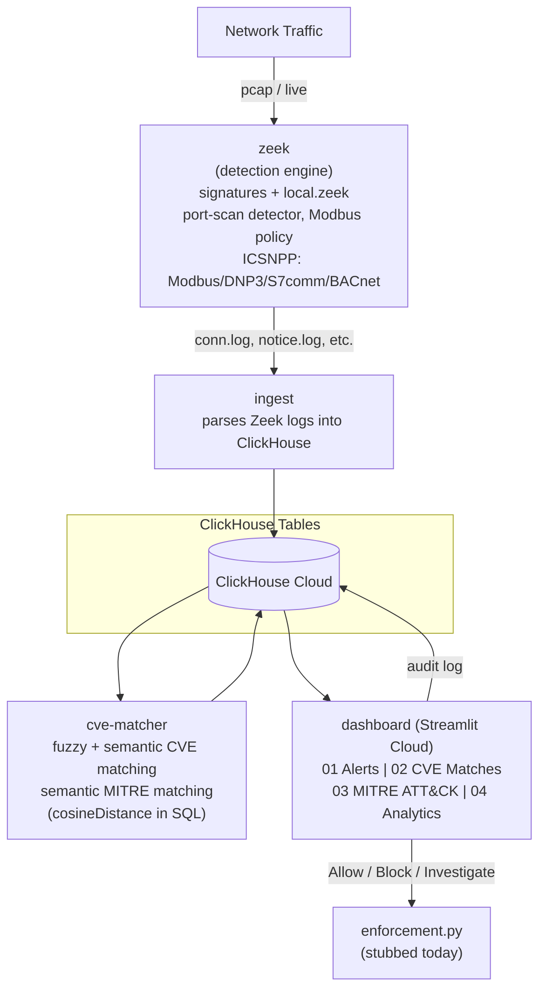

# Network IDS - Zeek + ClickHouse + Semantic SIEM Dashboard

    

A lightweight SIEM (Security Information and Event Management) pipeline.
Zeek watches network traffic and raises behavioral + signature-based
alerts; those alerts are semantically correlated against real NVD CVE
data and the MITRE ATT&CK Enterprise matrix, with everything - raw logs,
reference data, embeddings, and correlation results - stored in
ClickHouse. A Streamlit dashboard presents the result as a console-style
SIEM console, and analysts can act directly on alerts (Allow / Block /
Investigate) from the same screen.

**Current stack: Zeek -> ClickHouse -> Python (fuzzy + semantic matching,
using ClickHouse's native `cosineDistance()`) -> Streamlit, hosted on
Streamlit Community Cloud + ClickHouse Cloud.**

---

## Recent changes

- **Analyst response actions** - each alert can be marked Allow / Block /
  Investigate directly from the dashboard. Every action is written to a
  new `alert_actions` audit table (append-only - a full history of who
  decided what, and when) and routed through a pluggable enforcement
  module (`dashboard/enforcement.py`) that currently stubs real network
  enforcement, so the response workflow can be demoed before a live
  firewall/bridge backend exists. See "Response actions" below.
- **Hosted on Streamlit Community Cloud**, backed by **ClickHouse
  Cloud** instead of a local-only container, so the dashboard is
  reachable without running Docker locally.
- **Fixed an OT-traffic undercount bug**: Zeek's actual DNP3 service
  label is `dnp3_tcp` (not `dnp3`), and Zeek sometimes writes a
  comma-joined service string (e.g. `"ssl,modbus"`) when more than one
  analyzer matches a connection. `classify_zone()` in `ingest.py` now
  splits on commas and checks every token, so OT traffic hiding behind
  either case is no longer misclassified as IT.
- **Migrated from ChromaDB to ClickHouse** - see "Project history" below
  for the full story and why.

---

## 1. Architecture diagram



All services run as separate containers via `docker-compose.yml`,
communicating over the compose network (or pointed at ClickHouse Cloud
for the hosted dashboard). **ClickHouse is the single source of
truth.** Tables: `alerts`, `software`, `cve_descriptions`,
`mitre_attack`, `cve_matches`, `mitre_matches`, `connection_stats`,
`alert_actions`.

---

## 2. Why ClickHouse (and why *semantic* correlation still works)

A traditional SIEM matches alerts to threat intel using exact keyword or
regex rules. Here, CVE descriptions, MITRE ATT&CK technique descriptions,
and software strings are embedded (via `sentence-transformers`,
`all-MiniLM-L6-v2`) into the same vector space, stored as
`Array(Float32)` columns, and compared with ClickHouse's native
`cosineDistance()` function directly in SQL. That means an alert like
*"192.168.2.53: Plaintext FTP credentials observed"* can still be
matched to the MITRE technique **T1071.002 - File Transfer Protocols**
even though the alert text and the technique description share almost
no exact words - the match is on *meaning*, not string overlap. This
happens inside a structured database that also gives full-fidelity
relational storage for raw logs, joins, and IT/OT analytics - rather
than needing a separate vector-only store.

---

## 3. Service-by-service breakdown

### `zeek`
Runs Zeek against captured/replayed traffic. Two custom detection
mechanisms sit alongside Zeek's built-in signature framework:
- **Port-scan detector** (`ScanDetect::Possible_Port_Scan`) -- behavioral,
  flags a host touching many distinct destination ports in a short window.
- **Modbus write policy** -- flags unauthorized/unexpected Modbus
  (industrial control protocol) write operations, relevant for OT/ICS
  security scenarios.
- Signature framework (`signatures/`) catches known-bad patterns
  (e.g. plaintext FTP credentials, suspicious Modbus diagnostic function
  codes).
- **ICSNPP packages** (CISA/INL, installed via `zkg`) provide extended
  Modbus, DNP3, S7comm, and BACnet analyzers with their own dedicated
  logs, so OT protocol traffic gets properly classified instead of
  folding into a generic `conn.log` entry.

### `ingest`
Parses Zeek's output logs and writes structured rows into ClickHouse:
- **`alerts`** -- every flagged event, with a `severity` and IT/OT `zone` field.
- **`software`** -- detected software/versions per host, used for CVE matching.
- **`connection_stats`** -- a *pre-aggregated* protocol/zone breakdown of
  every connection Zeek observed (not just alerted ones). Captures can
  contain hundreds of thousands to millions of connection records, so
  this is computed in plain Python (a `Counter` over `(zone, service)`
  pairs) rather than as an individually-searchable row per connection.
- Every known OT service name (from Zeek's built-ins and the ICSNPP
  packages above) is listed explicitly in `OT_SERVICES`, and the
  service string is split on commas before matching, so nothing
  silently falls out of the IT/OT split.

### `cve-matcher` (`match_cve.py`)
Runs two independent matching passes in a loop:

1. **`match_software_to_cve`** -- for every detected software+version,
   tries (a) fuzzy string matching (`rapidfuzz`, threshold 70) against a
   keyword field on each CVE, and (b) semantic search
   (`cosineDistance()`, distance threshold 1.1) against embedded CVE
   descriptions stored in ClickHouse. Both match types are kept and
   tagged (`match_type: fuzzy` / `semantic`).

2. **`match_alerts_to_mitre`** -- semantic search only, scoped to
   high/critical severity alerts (mirrors real SOC triage). Results
   commit to ClickHouse every 5 alerts rather than in one batch at the
   end, so a crash mid-run only loses a few seconds of work.

### `clickhouse` (ClickHouse Cloud in the hosted deployment)
The single data store. Tables: `alerts`, `software`, `cve_descriptions`,
`mitre_attack` (reference data with embeddings, rebuilt every 15 minutes
from cached NVD/MITRE JSON), `cve_matches`, `mitre_matches`,
`connection_stats`, `alert_actions` (results + audit log). Schema loads
automatically on first startup from `clickhouse/schema.sql` for local
runs; for ClickHouse Cloud, run the same file's statements once via the
Cloud SQL console.

### `dashboard` (`app.py`, Streamlit, hosted on Streamlit Community Cloud)
Reads directly from ClickHouse via SQL and renders four tabs:
- **[01] Alerts** -- per-alert cards with severity/zone/status badges,
  a live "Recent Actions" audit feed, and inline **Allow / Block /
  Investigate** buttons on every card (see "Response actions" below).
- **[02] CVE Matches** -- matched software/CVE pairs with CVSS scores.
- **[03] MITRE ATT&CK** -- matched alert/technique pairs with a
  tactic-distribution chart.
- **[04] Analytics** -- deeper-dive views: IT vs OT traffic split, full
  protocol/service mix (from real `conn.log` data), alert trends over
  time, top source hosts, CVSS distribution, and most common ATT&CK
  techniques.

---

## 4. Response actions (Allow / Block / Investigate)

Every alert card has three action buttons. Clicking one:

1. Writes a row to **`alert_actions`** (append-only - never overwritten,
   so the full decision history survives, not just the latest state).
2. Calls `enforcement.py`'s `apply_block()` or `apply_allow()`, which
   **today only report back what would happen** - no live network
   enforcement backend exists yet. `Investigate` skips enforcement
   entirely and is a pure triage flag.
3. Updates the alert's Status badge (Open / Allowed / Blocked /
   Investigating), computed as the most recent action per alert via
   `argMax(action, ts)` - so status always reflects the latest decision
   even though every past decision is preserved.

**To go live later:** replace the body of `apply_block()` in
`dashboard/enforcement.py` with a real call - e.g. SSH into the bridge
host set up by `setup_bridge.sh` and push an `nftables`/`iptables` rule,
or call a firewall/SDN controller's API. `app.py` never needs to
change - it only depends on the `EnforcementResult` shape the module
returns, so swapping the backend is a self-contained change.

---

## 5. Hosting

- **Dashboard**: Streamlit Community Cloud, deployed from this repo's
  `main` branch, entry point `dashboard/app.py`.
- **Database**: ClickHouse Cloud. Credentials are supplied via
  Streamlit's **Secrets** panel (`st.secrets["clickhouse"]`) rather than
  environment variables, since Streamlit Cloud has no plain env var
  mechanism. `app.py`'s `_config()` helper checks `st.secrets` first and
  falls back to environment variables, so the same code runs unchanged
  against a local Docker `clickhouse` service.
- **Local Docker Compose** still works standalone (its own `clickhouse`
  service, schema auto-loaded via `docker-entrypoint-initdb.d`) for
  development without touching the hosted Cloud data.

---

## 6. How to run it locally

```bash
# Bring up the data store first - schema auto-loads on first start
docker compose up -d clickhouse

# Bring up the dashboard (reads existing ClickHouse data)
docker compose up -d dashboard
# then open http://localhost:8501
```

To regenerate correlations from scratch (e.g. after new Zeek data):

```bash
docker compose up -d zeek ingest
# wait for ingest to finish, then:
docker compose up -d cve-matcher
docker compose logs -f cve-matcher
# once "MITRE pass complete" appears and CVE matching has settled:
docker compose stop cve-matcher
```

---

## 7. Design decisions worth knowing

- **MITRE correlation is scoped to high/critical alerts only** -- a
  deliberate triage decision mirroring real analyst workflow.
- **`connection_stats` is aggregated, not per-row** -- see the `ingest`
  section above. A real architectural correction made after discovering
  the per-connection-embedding approach didn't scale.
- **Embeddings are computed explicitly with `sentence-transformers`**
  before every semantic query, then compared via ClickHouse's
  `cosineDistance()` -- that step is visible in `match_cve.py` rather
  than hidden inside a vector database.
- **PyArrow/pandas versions are constrained** in `dashboard/requirements.txt`
  and `dashboard/runtime.txt` pins Python to 3.11, to avoid Streamlit
  Cloud falling back to a from-source build of pandas that fails on the
  build image.
- **`alert_actions` is append-only by design** -- current status is a
  query-time aggregate (`argMax` by timestamp), not a mutated field, so
  the audit trail is never lost.

---

## 8. Project history: the ChromaDB -> ClickHouse pivot

<details>
<summary>Click to expand - architectural history.</summary>

An earlier version of this project used ChromaDB as a single
vector-only data store, with `connection_stats` aggregation computed in
Python and pushed to ChromaDB as a small summary. That design was
replaced with the current ClickHouse-based architecture after IT/OT
protocol traffic stopped displaying correctly and log fidelity was
being lost relative to Zeek's raw `conn.log`. The root cause traced
back to services that weren't explicitly mapped to an IT/OT zone
silently falling out of classification. The fix combines: (1) every
known OT service name (including the ICSNPP protocol analyzers) listed
explicitly in `ingest.py`'s `OT_SERVICES`, with comma-joined service
strings split and checked token-by-token, and (2) ClickHouse storing
full raw log rows rather than only a pre-aggregated summary. Semantic
CVE/MITRE correlation was kept by computing embeddings explicitly with
`sentence-transformers` and comparing them with ClickHouse's native
`cosineDistance()` function - no separate vector store needed.

An even earlier design used ClickHouse alongside Suricata before that
was itself replaced with the ChromaDB-only design. The current system
uses Zeek + ClickHouse only, with semantic search implemented as vector
columns and SQL functions rather than a dedicated vector database.

</details>

---

## 9. File map

```
docker-compose.yml        - orchestrates all services
clickhouse/
  schema.sql               - table definitions, auto-loaded locally on first start
zeek/
  local.zeek               - Zeek script config, loads custom detectors + ICSNPP packages
  signatures/               - signature framework rules
  entrypoint.sh
  Dockerfile
cve/
  match_cve.py              - CVE + MITRE matching logic (ClickHouse + cosineDistance)
  fetch_cve.py               - pulls NVD CVE data
  fetch_mitre.py              - pulls MITRE ATT&CK Enterprise data
  cve_data/                    - cached reference datasets
  entrypoint.sh
  Dockerfile
dashboard/
  app.py                    - Streamlit SIEM console (4 tabs + response actions)
  enforcement.py             - pluggable Allow/Block enforcement hook (stubbed)
  requirements.txt          - streamlit, clickhouse-connect, pandas, plotly
  runtime.txt                - pins Python 3.11 for Streamlit Cloud builds
  Dockerfile
ingest/
  ingest.py                 - parses Zeek logs into ClickHouse
  Dockerfile
```
