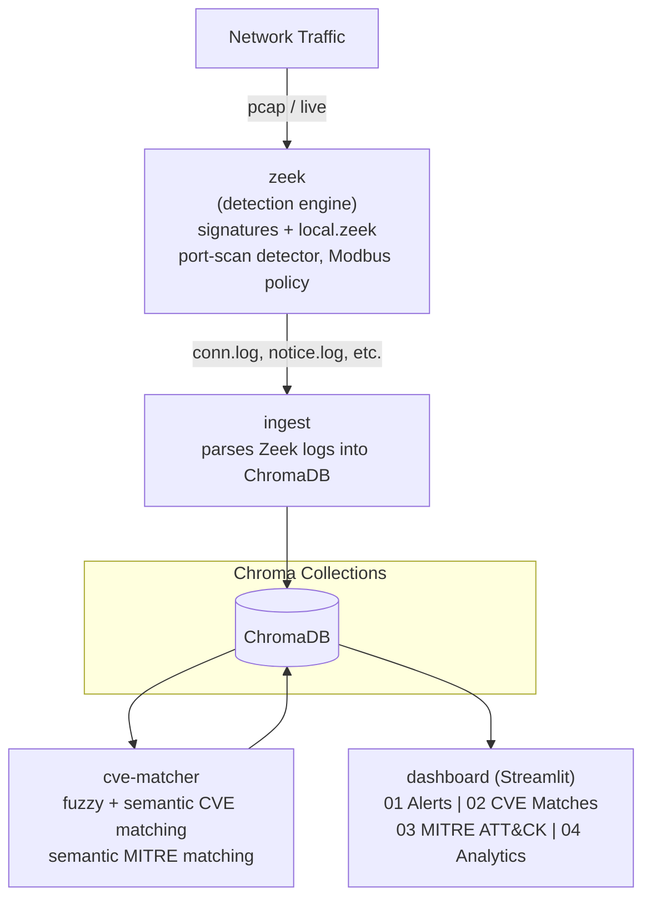

# Network IDS - Zeek + ChromaDB + Semantic SIEM Dashboard

    

A lightweight, single-vector-store Security Information and Event Management
(SIEM) pipeline. Zeek watches network traffic and raises behavioral +
signature-based alerts; those alerts are semantically correlated against
real NVD CVE data and the MITRE ATT&CK Enterprise matrix, using embeddings
stored entirely in ChromaDB. A Streamlit dashboard presents the result as a
console-style SIEM console.

**Current stack: Zeek -> ChromaDB -> Python (fuzzy + semantic matching) -> Streamlit.**
No other databases involved -- everything (raw alerts, reference data, and
correlation results) lives in ChromaDB as a single, lightweight data store.

---

## 1. Architecture diagram



All services run as separate containers via `docker-compose.yml`,
communicating over the compose network. **ChromaDB is the single source of
truth** -- no relational or structured database is involved anywhere in the
stack. Collections stored in ChromaDB: `alerts`, `software`,
`cve_descriptions`, `mitre_attack`, `cve_matches`, `mitre_matches`,
`connection_stats`.

---

## 2. Why ChromaDB (and why *semantic* correlation)

A traditional SIEM matches alerts to threat intel using exact keyword or
regex rules. Here, everything -- CVE descriptions, MITRE ATT&CK technique
descriptions, alert messages -- is embedded into the same vector space
(via ChromaDB's default `all-MiniLM-L6-v2` sentence-transformer model).
That means an alert like *"192.168.2.53: Plaintext FTP credentials
observed"* can be matched to the MITRE technique **T1071.002 - File
Transfer Protocols** even though the alert text and the technique
description share almost no exact words -- the match is on *meaning*,
not string overlap. This is the core idea of the project.

---

## 3. Service-by-service breakdown

### `zeek`
Runs Zeek against captured/replayed traffic. Two custom detection
mechanisms sit alongside Zeek's built-in signature framework:
- **Port-scan detector** (`ScanDetect::Possible_Port_Scan`) -- behavioral,
  flags a host touching many distinct destination ports in a short window.
- **Modbus write policy** -- flags unauthorized/unexpected Modbus
  (industrial control protocol) write operations, relevant for OT/ICS
  security scenarios.
- Signature framework (`signatures/`) catches known-bad patterns
  (e.g. plaintext FTP credentials, suspicious Modbus diagnostic function
  codes).

### `ingest`
Parses Zeek's output logs and writes structured records into ChromaDB:
- **`alerts`** -- every flagged event, with a `severity` and IT/OT `zone` field.
- **`software`** -- detected software/versions per host, used for CVE matching.
- **`connection_stats`** -- a *pre-aggregated* protocol/zone breakdown of
  every connection Zeek observed (not just alerted ones). Captures can
  contain hundreds of thousands to millions of connection records, so
  this is computed in plain Python (a `Counter` over `(zone, service)`
  pairs) rather than embedding each connection individually -- the naive
  per-row approach was tried first and was projected to take 15+ hours
  on a full capture; the aggregated version processes the same data in
  under a second.

### `cve-matcher` (`match_cve.py`)
Runs two independent matching passes in a loop:

1. **`match_software_to_cve`** -- for every detected software+version,
   tries (a) fuzzy string matching (`rapidfuzz`, threshold 70) against a
   keyword field on each CVE, and (b) semantic search against embedded
   CVE descriptions (distance threshold 1.1). Both match types are kept
   and tagged (`match_type: fuzzy` / `semantic`).

2. **`match_alerts_to_mitre`** -- semantic search only, scoped to
   high/critical severity alerts (mirrors real SOC triage -- map the
   serious incidents to attacker techniques first). Results commit to
   ChromaDB every 5 alerts rather than in one batch at the end, so a
   crash mid-run only loses a few seconds of work.

### `chroma`
The single data store. Collections: `alerts`, `software`,
`cve_descriptions`, `mitre_attack` (reference data, embedded once and
reused), `cve_matches`, `mitre_matches`, `connection_stats` (results).

### `dashboard` (`app.py`, Streamlit)
Reads directly from ChromaDB and renders four tabs:
- **[01] Alerts** -- severity-filterable table + severity split chart.
- **[02] CVE Matches** -- matched software/CVE pairs with CVSS scores.
- **[03] MITRE ATT&CK** -- matched alert/technique pairs with a
  tactic-distribution chart.
- **[04] Analytics** -- deeper-dive views: IT vs OT traffic split, full
  protocol/service mix (from real `conn.log` data, not just alerted
  traffic), alert trends over time, top source hosts, CVSS distribution,
  and most common ATT&CK techniques. Kept in a separate tab so the core
  three views stay quick to scan.

---

## 4. How to run it

```bash
# Bring up the data store first
docker compose up -d chroma

# Bring up the dashboard (reads existing ChromaDB data)
docker compose up -d dashboard
# then open http://localhost:8501
```

To regenerate correlations from scratch (e.g. after new Zeek data):

```bash
docker compose up -d zeek ingest
# wait for ingest to finish, then:
docker compose up -d cve-matcher
docker compose logs -f cve-matcher
# once "MITRE pass complete" appears and CVE matching has settled:
docker compose stop cve-matcher
```

---

## 5. Design decisions worth knowing

- **MITRE correlation is scoped to high/critical alerts only** -- a
  deliberate triage decision (mirrors real analyst workflow), not a
  technical limitation. Configurable via `MITRE_SEVERITY_FILTER=all`.
- **`connection_stats` is aggregated, not per-row** -- see the `ingest`
  section above. This was a real architectural correction made after
  discovering the per-connection-embedding approach didn't scale.
- **PyArrow is pinned (`14.0.2`)** in `dashboard/requirements.txt` --
  an unpinned version caused a native segfault (`libarrow.so`, exit
  code 139) under Streamlit's dataframe rendering on certain data
  shapes.

---

## 6. Project history: the ClickHouse -> ChromaDB pivot

<details>
<summary>Click to expand -- architectural history, useful context for a viva/interview but not required reading to understand the current system.</summary>

An earlier version of this project used ClickHouse (a structured
analytical database) alongside Suricata for signature-based detection.
That design was replaced with the current ChromaDB-only, Zeek-only
architecture for two reasons: (1) ChromaDB's vector search enables
*semantic* CVE/MITRE correlation for free, which a relational database
doesn't give you without bolting on a separate embedding/search layer,
and (2) using one data technology for both raw storage and correlation
results keeps the stack simpler to reason about and deploy. Zeek's own
scripting layer (behavioral detectors + signature framework) replaced
what Suricata was doing, removing a second detection engine to maintain.

**If you're reading this repo's history:** any earlier reference to
ClickHouse or Suricata reflects this discarded design, not the current
system. The current system -- described in every section above -- uses
Zeek + ChromaDB only.

</details>

---

## 7. Anticipated viva / interview questions

**Q: Why ChromaDB instead of a traditional relational/structured DB?**
A: The core value is *semantic* correlation -- matching alert text to
MITRE technique descriptions or CVE descriptions based on meaning, not
exact keywords. A vector store gives that natively.

**Q: What's the difference between the fuzzy and semantic CVE matches?**
A: Fuzzy matching (`rapidfuzz.partial_ratio`) catches near-exact string
overlaps -- fast, precise, brittle to phrasing. Semantic matching embeds
both sides into the same vector space and finds nearest neighbors --
catches conceptually related matches fuzzy matching would miss.

**Q: Why do you only correlate high/critical alerts against MITRE?**
A: Deliberate triage design mirroring real analyst workflow, not a
technical limitation -- configurable via an environment variable.

**Q: Tell me about a mistake you made and fixed in this project.**
A: The original `connection_stats` design embedded every single Zeek
connection record individually for semantic search -- but nobody needs
to *search* a connection record, only count it by protocol/zone. On a
~950K-connection capture this was projected to take 15+ hours. I
rewrote it to aggregate counts in plain Python during ingest and push
only the small resulting summary (a few dozen rows) to ChromaDB,
cutting that to under a second while preserving full visibility.

**Q: What would productionization need beyond this?**
A: Multi-tenant support, an authentication layer on the dashboard,
horizontal scaling of the embedding/matching workers, a proper
alerting/notification layer (Slack/email/webhook on high-confidence
matches), and likely a security-domain fine-tuned embedding model to
improve match precision over the default general-purpose one.

---

## 8. File map

```
docker-compose.yml        - orchestrates all services
zeek/
  local.zeek               - Zeek script config, loads custom detectors
  signatures/               - signature framework rules
  entrypoint.sh
  Dockerfile
cve/
  match_cve.py              - CVE + MITRE matching logic
  fetch_cve.py               - pulls NVD CVE data
  fetch_mitre.py              - pulls MITRE ATT&CK Enterprise data
  cve_data/                    - cached reference datasets
  entrypoint.sh
  Dockerfile
dashboard/
  app.py                    - Streamlit SIEM console (4 tabs)
  requirements.txt          - streamlit, chromadb, pandas, plotly, pyarrow (pinned)
  Dockerfile
ingest/
  ingest.py                 - parses Zeek logs into ChromaDB
  Dockerfile
```