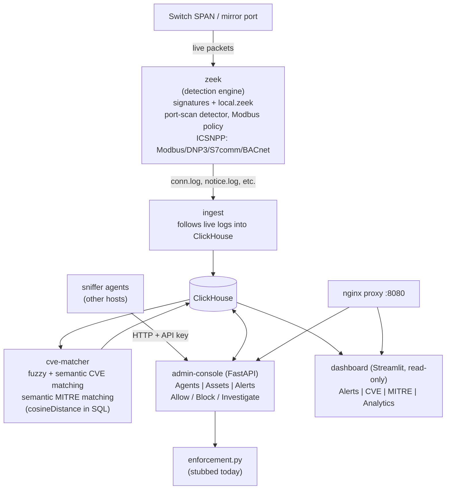

# Live IT/OT Network IDS - Zeek + ClickHouse + Semantic SIEM Console

    

A lightweight, self-hosted IDS/SIEM appliance for mixed IT and OT
(industrial) networks. Zeek **sniffs live traffic from a switch SPAN /
mirror port** and raises behavioral + signature-based alerts; those alerts
are semantically correlated against real NVD CVE data and the MITRE
ATT&CK Enterprise matrix, with everything - raw logs, reference data,
embeddings, and correlation results - stored in ClickHouse. Analysts use
one web front door: an **admin console** (login, agents, assets, alerts,
Allow / Block / Investigate actions) plus a read-only Streamlit
**dashboard** of charts.

**Current stack: Zeek (live capture) -> ClickHouse -> Python (fuzzy +
semantic matching, using ClickHouse's native `cosineDistance()`) ->
FastAPI admin console + Streamlit dashboard, behind an nginx proxy -
all in Docker Compose on one sensor box.**

---

## Recent changes

- **Live capture from a switch** - pcap replay removed. Zeek sniffs the
  NIC named by `LIVE_IFACE` (`network_mode: host`), rotates logs hourly,
  and `ingest` follows the active log files like `tail -F`, remembering
  its position across restarts. See "Live capture" below.
- **Single front door** - nginx publishes only port 8080: the admin
  console at `/` and the read-only dashboard at `/dashboard/`.
- **Admin console + distributed agents** - HTTP-Basic-protected console
  with Agents / Assets / Alerts views; remote machines run
  `agent/sniffer_agent.py` and report in with a shared API key.
- **Analyst response actions** - each alert can be marked Allow / Block /
  Investigate directly from the dashboard. Every action is written to a
  new `alert_actions` audit table (append-only - a full history of who
  decided what, and when) and routed through a pluggable enforcement
  module (`dashboard/enforcement.py`) that currently stubs real network
  enforcement, so the response workflow can be demoed before a live
  firewall/bridge backend exists. See "Response actions" below.
- **Fixed an OT-traffic undercount bug**: Zeek's actual DNP3 service
  label is `dnp3_tcp` (not `dnp3`), and Zeek sometimes writes a
  comma-joined service string (e.g. `"ssl,modbus"`) when more than one
  analyzer matches a connection. `classify_zone()` in `ingest.py` now
  splits on commas and checks every token, so OT traffic hiding behind
  either case is no longer misclassified as IT.
- **Migrated from ChromaDB to ClickHouse** - see "Project history" below
  for the full story and why.

---


## Live capture from a switch (SPAN / mirror port)

Zeek sniffs a real network card; pcap replay has been removed.

1. On the switch, mirror the traffic you want to inspect to one port
   (SPAN / port mirroring - needs a *managed* switch).
2. Plug that switch port into a spare NIC on the sensor box. Use a
   *different* NIC for SSH / the web UI.
3. Find the NIC name with `ip -br link` (plug the cable in and watch which
   one shows `UP`), then `cp .env.example .env` and set `LIVE_IFACE`.
4. `docker compose up -d --build`
5. Check: `docker logs ids_zeek` (should say "Live capture on ..."),
   then `docker exec ids_zeek ls -la /usr/local/zeek/logs` - `conn.log`
   should grow within a minute. The UI is at `http://<box-ip>:8080`.

The zeek container sets the NIC to promiscuous mode and turns off
GRO/LRO/TSO/GSO on every start. Zeek rotates logs hourly; ingest follows
the active files and remembers its position across restarts; rotated logs
are deleted after `LOG_RETENTION_DAYS` (default 7).

`zeek/setup_bridge.sh` is only needed for an *inline* deployment (box
between two devices), not for SPAN.

## 1. Architecture diagram


```mermaid
flowchart TD
    SW[Switch SPAN / mirror port] -->|live packets| B["zeek<br/>(detection engine)<br/>signatures + local.zeek<br/>port-scan detector, Modbus policy<br/>ICSNPP: Modbus/DNP3/S7comm/BACnet"]
    B -->|conn.log, notice.log, etc.| C["ingest<br/>follows live logs into ClickHouse"]
    C --> D[(ClickHouse)]
    D --> E["cve-matcher<br/>fuzzy + semantic CVE matching<br/>semantic MITRE matching<br/>(cosineDistance in SQL)"]
    E --> D
    AG["sniffer agents<br/>(other hosts)"] -->|HTTP + API key| AC
    D <--> AC["admin-console (FastAPI)<br/>Agents | Assets | Alerts<br/>Allow / Block / Investigate"]
    D --> F["dashboard (Streamlit, read-only)<br/>Alerts | CVE | MITRE | Analytics"]
    AC --> G["enforcement.py<br/>(stubbed today)"]
    P["nginx proxy :8080"] --> AC
    P --> F
```

All services run as separate containers via `docker-compose.yml`. Only
the nginx proxy publishes a port (`PROXY_PORT`, default 8080); ClickHouse,
the dashboard and the admin console are reachable only on the internal
Docker network. **ClickHouse is the single source of truth.** Tables:
`alerts`, `software`, `cve_descriptions`, `mitre_attack`, `cve_matches`,
`mitre_matches`, `connection_stats`, `alert_actions`, plus the agent and
asset tables defined in `clickhouse/schema.sql`.

---

## 2. Why ClickHouse (and why *semantic* correlation still works)

A traditional SIEM matches alerts to threat intel using exact keyword or
regex rules. Here, CVE descriptions, MITRE ATT&CK technique descriptions,
and software strings are embedded (via `sentence-transformers`,
`all-MiniLM-L6-v2`) into the same vector space, stored as
`Array(Float32)` columns, and compared with ClickHouse's native
`cosineDistance()` function directly in SQL. That means an alert like
*"192.168.2.53: Plaintext FTP credentials observed"* can still be
matched to the MITRE technique **T1071.002 - File Transfer Protocols**
even though the alert text and the technique description share almost
no exact words - the match is on *meaning*, not string overlap. This
happens inside a structured database that also gives full-fidelity
relational storage for raw logs, joins, and IT/OT analytics - rather
than needing a separate vector-only store.

---

## 3. Service-by-service breakdown

### `zeek`
Runs Zeek against live traffic on the capture NIC. Two custom detection
mechanisms sit alongside Zeek's built-in signature framework:
- **Port-scan detector** (`ScanDetect::Possible_Port_Scan`) -- behavioral,
  flags a host touching many distinct destination ports in a short window.
- **Modbus write policy** -- flags unauthorized/unexpected Modbus
  (industrial control protocol) write operations, relevant for OT/ICS
  security scenarios.
- Signature framework (`signatures/`) catches known-bad patterns
  (e.g. plaintext FTP credentials, suspicious Modbus diagnostic function
  codes).
- **ICSNPP packages** (CISA/INL, installed via `zkg`) provide extended
  Modbus, DNP3, S7comm, and BACnet analyzers with their own dedicated
  logs, so OT protocol traffic gets properly classified instead of
  folding into a generic `conn.log` entry.

### `ingest`
Parses Zeek's output logs and writes structured rows into ClickHouse:
- **`alerts`** -- every flagged event, with a `severity` and IT/OT `zone` field.
- **`software`** -- detected software/versions per host, used for CVE matching.
- **`connection_stats`** -- a *pre-aggregated* protocol/zone breakdown of
  every connection Zeek observed (not just alerted ones). Captures can
  contain hundreds of thousands to millions of connection records, so
  this is computed in plain Python (a `Counter` over `(zone, service)`
  pairs) rather than as an individually-searchable row per connection.
- Every known OT service name (from Zeek's built-ins and the ICSNPP
  packages above) is listed explicitly in `OT_SERVICES`, and the
  service string is split on commas before matching, so nothing
  silently falls out of the IT/OT split.

### `cve-matcher` (`match_cve.py`)
Runs two independent matching passes in a loop:

1. **`match_software_to_cve`** -- for every detected software+version,
   tries (a) fuzzy string matching (`rapidfuzz`, threshold 70) against a
   keyword field on each CVE, and (b) semantic search
   (`cosineDistance()`, distance threshold 1.1) against embedded CVE
   descriptions stored in ClickHouse. Both match types are kept and
   tagged (`match_type: fuzzy` / `semantic`).

2. **`match_alerts_to_mitre`** -- semantic search only, scoped to
   high/critical severity alerts (mirrors real SOC triage). Results
   commit to ClickHouse every 5 alerts rather than in one batch at the
   end, so a crash mid-run only loses a few seconds of work.

### `clickhouse`
The single data store. Tables: `alerts`, `software`, `cve_descriptions`,
`mitre_attack` (reference data with embeddings, rebuilt every 15 minutes
from cached NVD/MITRE JSON), `cve_matches`, `mitre_matches`,
`connection_stats`, `alert_actions` (results + audit log). Schema loads
automatically on first startup from `clickhouse/schema.sql`.

### `dashboard` (`app.py`, Streamlit, read-only, served at `/dashboard/`)
Reads directly from ClickHouse via SQL and renders four tabs:
- **[01] Alerts** -- per-alert cards with severity/zone/status badges and
  a recent-actions audit feed.
- **[02] CVE Matches** -- matched software/CVE pairs with CVSS scores.
- **[03] MITRE ATT&CK** -- matched alert/technique pairs with a
  tactic-distribution chart.
- **[04] Analytics** -- IT vs OT traffic split, full protocol/service mix
  (from real `conn.log` data), alert trends over time, top source hosts,
  CVSS distribution, and most common ATT&CK techniques.

### `admin-console` (`admin-console/main.py`, FastAPI, served at `/`)
The operator-facing site (static UI in `admin-console/static/`).
- **Login**: HTTP Basic, credentials from `ADMIN_USER` / `ADMIN_PASSWORD`.
- **Agents** -- machines running `agent/sniffer_agent.py` check in every
  ~30 s and show as active / disconnected; the install page shows the
  shared key.
- **Assets** -- discovered hosts, manual add, admin notes and per-asset
  policy.
- **Alerts** -- alert list with **Allow / Block / Investigate** actions.
- **API**: `/api/assets`, `/api/alerts`, `/api/alerts/action`,
  `/api/agents`, `/api/agents/install-info` (admin login);
  `/api/agents/checkin` and `/api/agents/logs` (agents, header
  `X-Agent-Key` = `AGENT_API_KEY`).

### `proxy` (nginx, `nginx/nginx.conf`)
Single front door on `PROXY_PORT` (default 8080): `/` -> admin console,
`/dashboard/` -> Streamlit (including its websocket).

---

## 4. Response actions (Allow / Block / Investigate)

Every alert in the admin console has three actions. Clicking one:

1. Writes a row to **`alert_actions`** (append-only - never overwritten,
   so the full decision history survives, not just the latest state).
2. Calls `enforcement.py`'s `apply_block()` or `apply_allow()`, which
   **today only report back what would happen** - no live network
   enforcement backend exists yet. `Investigate` skips enforcement
   entirely and is a pure triage flag.
3. Updates the alert's Status (Open / Allowed / Blocked / Investigating),
   computed as the most recent action per alert via `argMax(action, ts)`.

**To go live later:** replace the body of `apply_block()` in
`admin-console/enforcement.py` with a real call - e.g. SSH into the
bridge host set up by `zeek/setup_bridge.sh` and push an
`nftables`/`iptables` rule, or call a firewall/SDN controller's API.

---

## 5. Deployment (sensor box)

Everything runs with Docker Compose on one Linux box (tested target: a
fanless 6-port industrial mini PC with Ubuntu Server). Use one NIC for
management (SSH + web UI) and a different NIC for capture.

1. Install Ubuntu Server (with OpenSSH) and Docker.
2. `git clone` this repo, `cp .env.example .env`, set `LIVE_IFACE`.
3. **Change the default secrets in `docker-compose.yml`** before putting
   the box on a shared network: `CLICKHOUSE_PASSWORD`, `ADMIN_PASSWORD`,
   `AGENT_API_KEY`.
4. `docker compose up -d --build`, then open `http://<box-ip>:8080`.

The CVE/MITRE reference datasets live in `cve/cve_data/`. If they are
missing, `cve-matcher` downloads them on first start (needs internet).

---

## 6. Day-to-day commands

```bash
docker compose ps                      # are all services up?
docker compose logs -f zeek ingest     # capture + ingestion
docker compose logs -f cve-matcher     # correlation passes
docker compose down -v                 # wipe ALL data and start fresh
```

---

## 7. Design decisions worth knowing

- **MITRE correlation is scoped to high/critical alerts only** -- a
  deliberate triage decision mirroring real analyst workflow.
- **`connection_stats` is aggregated, not per-row** -- see the `ingest`
  section above. A real architectural correction made after discovering
  the per-connection-embedding approach didn't scale.
- **Embeddings are computed explicitly with `sentence-transformers`**
  before every semantic query, then compared via ClickHouse's
  `cosineDistance()` -- that step is visible in `match_cve.py` rather
  than hidden inside a vector database.
- **Live capture is rotation-safe** -- Zeek rotates logs hourly; `ingest`
  keeps the old file open until fully read, never reads half-written
  lines, and saves its offset so a restart neither duplicates alerts nor
  resets connection counts.
- **`alert_actions` is append-only by design** -- current status is a
  query-time aggregate (`argMax` by timestamp), not a mutated field, so
  the audit trail is never lost.

---

## 8. Project history: the ChromaDB -> ClickHouse pivot

<details>
<summary>Click to expand - architectural history.</summary>

An earlier version of this project used ChromaDB as a single
vector-only data store, with `connection_stats` aggregation computed in
Python and pushed to ChromaDB as a small summary. That design was
replaced with the current ClickHouse-based architecture after IT/OT
protocol traffic stopped displaying correctly and log fidelity was
being lost relative to Zeek's raw `conn.log`. The root cause traced
back to services that weren't explicitly mapped to an IT/OT zone
silently falling out of classification. The fix combines: (1) every
known OT service name (including the ICSNPP protocol analyzers) listed
explicitly in `ingest.py`'s `OT_SERVICES`, with comma-joined service
strings split and checked token-by-token, and (2) ClickHouse storing
full raw log rows rather than only a pre-aggregated summary. Semantic
CVE/MITRE correlation was kept by computing embeddings explicitly with
`sentence-transformers` and comparing them with ClickHouse's native
`cosineDistance()` function - no separate vector store needed.

An even earlier design used ClickHouse alongside Suricata before that
was itself replaced with the ChromaDB-only design. The current system
uses Zeek + ClickHouse only, with semantic search implemented as vector
columns and SQL functions rather than a dedicated vector database.

</details>

---

## 9. File map

```
docker-compose.yml        - orchestrates all services
.env.example              - LIVE_IFACE, BPF filter, retention, proxy port
clickhouse/
  schema.sql               - table definitions, auto-loaded on first start
zeek/
  local.zeek               - Zeek config: custom detectors, ICSNPP packages, hourly rotation
  signatures/custom.sig    - signature framework rules
  entrypoint.sh            - live capture startup (NIC prep, BPF, log cleanup)
  setup_bridge.sh          - only for INLINE deployment (not needed for SPAN)
  Dockerfile
ingest/
  ingest.py                - follows live Zeek logs into ClickHouse (tail -F style)
cve/
  match_cve.py             - CVE + MITRE matching (ClickHouse + cosineDistance)
  fetch_cve.py             - pulls NVD CVE data
  fetch_mitre.py           - pulls MITRE ATT&CK Enterprise data
  cve_data/                - cached reference datasets (cve_local.json, mitre_local.json)
  entrypoint.sh, Dockerfile
dashboard/
  app.py                   - read-only Streamlit charts (4 tabs)
  enforcement.py, requirements.txt, runtime.txt, Dockerfile
admin-console/
  main.py                  - FastAPI: login, agents, assets, alerts, actions
  enforcement.py           - pluggable Allow/Block hook (stubbed)
  static/                  - index.html, app.js, style.css
  Dockerfile
nginx/
  nginx.conf               - single front door (/ and /dashboard/)
agent/
  sniffer_agent.py         - lightweight agent for other Windows/Linux hosts
  ids-agent.service        - systemd unit for the agent on Linux
```
